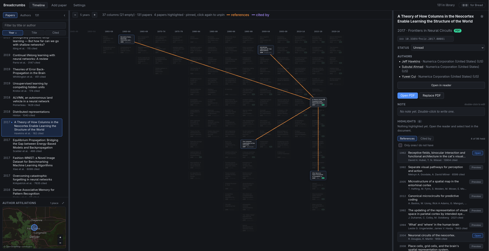
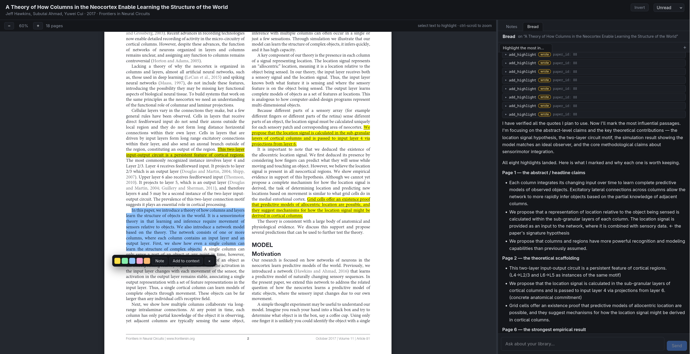

# Breadcrumbs

A local tool for studying a body of literature. It keeps papers, their
references, your notes and highlights in a SQLite database on your machine, and
lays the library out on a time grid so you can see how the work developed.

Papers are added one at a time, by you. Adding one records the identifiers of
everything it cites but creates no other papers; when you later add one of
those, the link appears on its own.



## Status

Built for my own use, and still changing often. The schema, the commands and the
layout all move without notice, and migrations are written for my library rather
than for anyone else's. Treat it as something to read and take ideas from rather
than something to depend on.

If you do run it, keep a copy of `library.db` before pulling.

## Install and run

```bash
./breadcrumbs install    # dependencies, both halves
./breadcrumbs run        # http://127.0.0.1:8000
```

`run` builds the frontend and serves it from the backend, so only one process
runs. For development, `dev` runs the backend and Vite with hot reload on both;
open http://localhost:5173.

`./breadcrumbs --help` lists every command, and each takes `--help` of its own.
Commands that serve take `--host` and `--port`; `HOST`, `PORT` and `PAGES` are
read from the environment too.

Your library lives in `~/Breadcrumbs`, or wherever `BREADCRUMBS_HOME` points:
`library.db` plus `pdfs/` and `authors/`. Notes and highlights are rows in the
database, not files.

## Settings

Two things are worth filling in before adding papers:

- **Contact email.** Sent to OpenAlex, Crossref and Unpaywall. Raises rate
  limits and is required by Unpaywall.
- **OpenAlex API key.** Free, from [openalex.org/pricing](https://openalex.org/pricing).
  Without one you share a small anonymous daily allowance, roughly a hundred
  requests. A key gets $1/day: a single record is free, a filtered list costs 1,
  a title search 10. Importing 130 papers cost about 900.

Optional:

- **Semantic Scholar key.** Needs an institutional application. Without it S2
  is skipped when it throttles and OpenAlex supplies references instead.
- **Institution proxy.** An EZproxy/OpenAthens prefix, used to build publisher
  links that go through your subscription.
- **AI keys.** A provider and a search provider (Brave or Tavily) for the
  assistant. Providers are Anthropic, OpenAI, OpenRouter, Gemini and DeepSeek;
  each lists its own models, so the picker shows what your key can reach rather
  than a hardcoded list.

## The grid

Every paper on one screen, in fixed columns of N years. A card's column depends
on its year alone, so nothing moves when a panel opens or a paper is selected.

- `− 5 years +` sets the interval, 1 to 50.
- Empty intervals keep their column, so width measures elapsed time.
- Newest at the top within a column.
- Scroll to zoom, drag to pan, middle-click a card to open it in its own tab.

Hovering or pinning a paper draws its links: orange for references, violet for
papers that cite it. Nothing is drawn at rest.

## Panels

**Left.** Papers or authors, filterable, sortable by year, title or citation
count. Below it, a map of author affiliations for whatever is in focus.

**Right.** The selected paper: status, authors, DOI, abstract, your note, its
marked passages, and two tabs. The first is the full reference list, with a
filter for the ones you do not hold; the second is the papers in your library
that cite it. Papers you do
not have can be previewed in place without saving anything.

Papers and authors can be starred.

## Adding papers

Paste a DOI, arXiv id, OpenAlex id or S2 hash, or search by title. Every lookup
queries all sources at once and streams results, showing a panel per source with
a Retry button for any that fail. Nothing is saved until you press save.

The same work is often indexed several times under different years: a journal
article, a book chapter, a later reissue. The Add screen lists every record it
finds and flags when an earlier one exists, so you can pick before saving.

| Source | Supplies | Key |
|---|---|---|
| OpenAlex | identity, authors, institutions, topics, references | free key, advised |
| Crossref | publisher metadata, licence, title search | none |
| Semantic Scholar | search suggestions, influential-citation count, fallback | rarely needed |
| Unpaywall | open-access PDF links | email required |
| arXiv | preprint PDFs, title search | none |

Only references are fetched, not citing papers. A bibliography is finite and can
be had in full; "who cites this" runs to tens of thousands for well-known work,
so any cap on it stores an arbitrary slice. Within your library nothing is lost:
if you hold both papers, the citing one's bibliography carries the edge, and the
graph draws it from both sides.

## PDFs

Open-access PDFs download automatically, trying every legal location rather than
only the one Unpaywall ranks first. arXiv is searched by title as well, since a
paper behind a paywall often has the author's manuscript there.

For paywalled work you get the publisher page, a PubMed record where one exists,
and the publisher page through your institutional proxy if you set one.
**Add PDF** attaches a file you already have.

There is no pirated-source integration.

## Reading



The reader opens in its own tab: PDF on the left, notes and the assistant on the
right.

- Select text to highlight it, attach a note, or send it to the assistant.
- **Box** in the toolbar draws a rectangle instead, for scanned PDFs with no
  text layer. It is offered automatically when a page has no text.
- Hovering a highlight shows its note.
- Notes render as Markdown with LaTeX; double-click to edit the source.

Highlights are stored as fractions of the page with the page size alongside, so
they survive re-downloading the PDF and render at any zoom.

## Authors

Each author has a biography, portrait, affiliations, their papers in your
library, and their wider output from OpenAlex. Identity is checked through
Wikidata rather than name matching, and lookups are cached including misses.

OpenAlex splits prolific authors across several records, so `dedupe_authors`
merges them; a merged author keeps every id it answered to, and papers arriving
under an old id resolve to it rather than recreating the duplicate.

## The assistant

One assistant with every capability as a tool. It reads your papers, authors,
links and notes, searches the web, reads the open PDF, and writes notes,
highlights, links, reading statuses and author homepages. It cannot add papers.
It proposes one and you decide.

Tool calls stream into the conversation as they happen, so a wrong action can be
caught while it runs. SQL access is read-only through a separate connection, not
a pattern check.

Configure under Settings → AI. Anthropic, OpenAI, OpenRouter, Gemini and
DeepSeek are all supported; the model picker is a combobox that matches tokens
independently, so `gpt 4o` and `4o gpt` both find `openai/gpt-4o`.

Only OpenRouter routes: for it you can pin the upstream provider, with endpoints
listed cheapest-first and fallbacks turned off. Everyone else serves their own
models, so the choice is hidden.

Claude is the one provider that does not speak the OpenAI shape, so it goes
through the official SDK rather than the shared HTTP client. Reasoning maps to
whichever form the model takes: current models think adaptively and take an
effort level, older ones a fixed token budget.

## Publishing a read-only copy

`./breadcrumbs pages` freezes the library into `./site`, four JSON files and a
reader built against them, with no backend or database. Any static host will
serve it.

```bash
./breadcrumbs pages
python3 -m http.server -d site 8080
```

Everything that writes is removed: no adding, no settings, no assistant, no
editing. Papers, authors, references, links and your notes are all readable.

Left out on purpose: **PDFs**, which belong to their publishers, and **settings
and conversations**, which hold your API keys. Only the routes in
`export_static.ROUTES` are written. The export makes no network requests.

Edit `pages.json` first. It sets the repository link and the wording of the
"what is this?" panel:

```json
{
  "repo_url": "https://github.com/YOUR-USERNAME/Breadcrumbs",
  "owner": "Ada",
  "title": "",
  "intro": ""
}
```

It ships as data, so changing it means re-running `pages`, not rebuilding.

An author's wider output is skipped, since listing it costs two live OpenAlex
requests per author. Pass `--with-works` for it.

While `dev` runs, the published copy is also served at
http://localhost:5173/readonly/.

## Maintenance

All of these take `--dry-run`.

| Command | Does |
|---|---|
| `./breadcrumbs backfill` | Re-fetches every paper's full reference list, then relinks. |
| `./breadcrumbs redate` | Fixes years taken from a reprint or digitised deposit, using the earliest a source reports. |
| `./breadcrumbs dedupe-authors` | Merges author rows that are the same person. |

`redate` and `backfill` depend on sources that rate-limit; re-run until they
report nothing left unverified.

`./breadcrumbs check` typechecks the frontend and imports the backend.
`clean` removes build output, `wipe` also removes installed dependencies.

## Layout

```
backend/src/backend/
  schema.sql    tables, indexes, seeded link types and shelves
  db.py         connections, settings, migrations
  ids.py        identifier normalisation, the basis of link matching
  sources/      one adapter per API, plus a rate-limited HTTP client
  store.py      upserts, link resolution, author merging, deletion
  ingest.py     fetch, merge, preview, save
  pdftext.py    page text, outline, quote to rectangles
  ai/           agent loop, tools, skills
  api.py        HTTP routes
frontend/src/
  api.ts                    typed client, and the static-export reader
  components/Timeline       the binned grid
  components/timelineLayout binning, card sizing, type metrics
  components/AddPaper       search, per-source preview, then save
  components/Reader         PDF, highlights, notes, assistant
  components/Settings       keys, fetch behaviour, source health check
```

Every request goes through one client with a per-host token bucket and
exponential backoff, so a source that throttles slows only itself.
